# Fulcrum 任务编排能力体验报告

**体验日期**: 2026-04-11
**体验方式**: Agent Browser (moat-browser) 远程操控 Chromium 实例
**Fulcrum 版本**: 4.10.0
**运行环境**: CachyOS Linux 6.19.11, AMD Ryzen 7 7840HS, 30GB RAM
**测试项目**: `task-tracker-cli` (临时 GitHub repo, 体验后已删除)

---

## 一、体验概述

本次体验从零开始，完整走通了 Fulcrum 的端到端 AI 任务编排工作流：从空白看板到 Claude agent 在隔离的 git worktree 中自动生成 294 行生产代码并创建 GitHub PR。整个过程通过远程浏览器自动化完成，覆盖了 Fulcrum 8 个核心页面和 3 种任务类型。

### 核心发现

Fulcrum 的设计哲学可以总结为一句话：**任务标题即 Prompt，Worktree 即沙箱，看板即调度中心**。它不对 AI agent 做任何包装或抽象，而是通过 terminal-first 的方式将任务描述直接传递给 Claude Code，让 agent 在隔离的 git 分支中自由工作。这种设计既保留了 agent 的全部能力，又通过 git worktree 隔离保证了工作安全性。

---

## 二、环境搭建

### 2.1 启动独立 Fulcrum 实例

由于主机上已有另一个 Fulcrum 实例占用了 `~/.fulcrum/fulcrum.db`（SQLite 文件锁），需要使用独立的 `FULCRUM_DIR` 启动自己的实例：

```bash
# 后端 (Hono.js + Bun)
FULCRUM_DIR=/tmp/fulcrum-test PORT=9999 HOST=0.0.0.0 bun server/index.ts

# 前端 (Vite + React)
VITE_BACKEND_PORT=9999 bunx vite --port 5199 --host 0.0.0.0
```

**关键细节**：
- 服务必须绑定到 `0.0.0.0` 而非默认的 `localhost`，因为 moat-browser 的 Chromium 容器需要通过宿主机 IP (`192.168.1.215`) 访问
- Fulcrum 使用 SQLite WAL 模式，同一数据库文件只允许一个进程写入

### 2.2 创建测试 GitHub 仓库

```bash
gh repo create test-fulcrum-demo --public --clone --add-readme
```

初始化了 Bun + TypeScript 基础脚手架（package.json, tsconfig.json, src/index.ts），推送到 GitHub 后在 Fulcrum 中注册：

```bash
curl http://localhost:9999/api/repositories -X POST -d '{
  "path": "/path/to/test-fulcrum-demo",
  "agent": "claude"
}'
```

### 2.3 远程浏览器连接

使用 moat-browser（自建的远程浏览器自动化方案）：
- Controller: `ws://192.168.1.211:3000`
- 每次 `moat init` 创建一个隔离的 Docker 容器，内含独立的 Chromium 进程
- 通过 `moat snapshot` 获取页面的 accessibility tree（`@e1`, `@e2` 等 ref），然后用 `moat click @eN` / `moat fill @eN` 进行交互

---

## 三、功能体验

### 3.1 Tasks 看板 — 核心调度界面

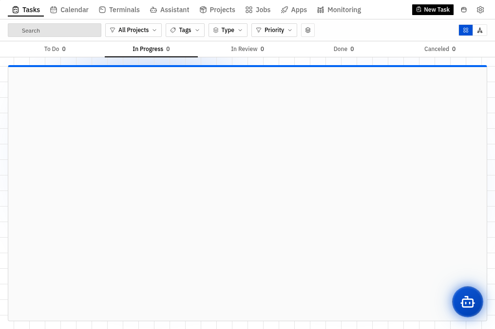

首次打开 `/tasks` 页面，展示的是 Kanban 视图。界面要素：

| 区域 | 内容 |
|------|------|
| 顶部导航 | Tasks, Calendar, Terminals, Assistant, Projects, Jobs, Apps, Monitoring |
| 工具栏 | 搜索框、All Projects 下拉、Tags 筛选、Type 筛选、Priority 筛选 |
| 视图切换 | Kanban view / Dependency graph（右上角两个图标按钮）|
| 状态列 | To Do, In Progress, In Review, Done, Canceled（每列带数量计数）|
| 右上角 | New Task 按钮（蓝色高亮）、Command Palette (Cmd+K)、Settings |

**Accessibility tree 片段**（通过 `moat snapshot` 获取）：
```
- tablist:
    - tab "To Do 0"
    - tab "In Progress 0" [selected]
    - tab "In Review 0"
    - tab "Done 0"
    - tab "Canceled 0"
```

### 3.2 创建任务 — "New Task" 对话框

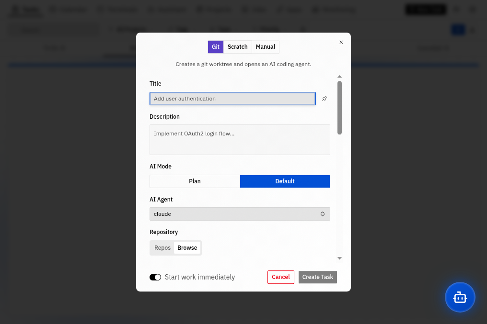

点击 "New Task" 按钮弹出的对话框是 Fulcrum 的核心交互之一。对话框包含：

**三种任务类型选择（顶部按钮组）**：
1. **Git** — "Creates a git worktree and opens an AI coding agent"
2. **Scratch** — "Creates an isolated directory with an AI coding agent, without a git repository"
3. **Manual** — 纯人工任务，无 agent/目录

**表单字段**（完整列表）：

| 字段 | 类型 | 说明 |
|------|------|------|
| Title | 文本输入 | **这就是传给 Claude agent 的 user prompt** |
| Description | 文本输入 | 补充说明，也会传给 agent |
| AI Mode | 按钮组 | Plan（先规划后执行）/ Default（直接执行）|
| AI Agent | 下拉选择 | claude / opencode |
| Repository | 标签页 | Repos（已注册）/ Browse（浏览选择）|
| Base Branch | 下拉 | 基于哪个分支创建 worktree |
| Branch Prefix | 文本输入 | 如 `ENG-123`，自动前缀到分支名 |
| Branch Name | 文本输入 | 自动从标题生成，可手动覆盖 |
| Estimate | 按钮组 | 1h / 2h / 3h / 5h / 8h / Custom |
| Priority | 按钮组 | Low / Medium / High |
| Tags | 标签输入 | 自由标签 |
| Due Date | 日期选择器 | 截止日期 |
| Notes | 文本输入 | 备注 |
| Blocked By | 搜索框 | 选择前置依赖任务 |
| Links | URL + Label | 关联链接 |
| GitHub PR | URL 输入 | 关联已有的 PR |
| Attachments | 文件上传 | PDF, images, docs (max 50MB) |
| Start work immediately | 开关 | 创建后是否立即启动 agent |

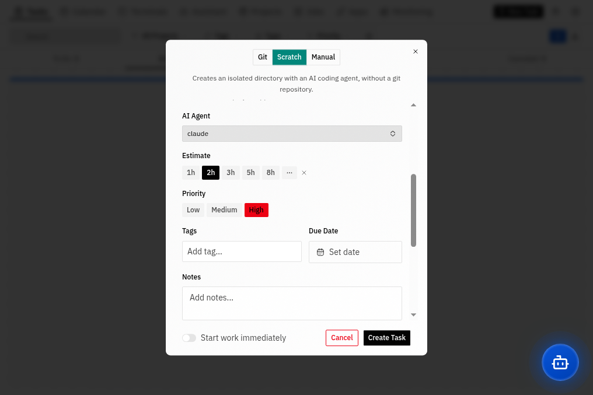

**体验记录**：创建了一个 Scratch 类型的演示任务 "Build a REST API with Bun"，设置 High 优先级和 2h 工时估算。关闭 "Start work immediately" 后点击 "Create Task"，任务立即出现在 To Do 列中。

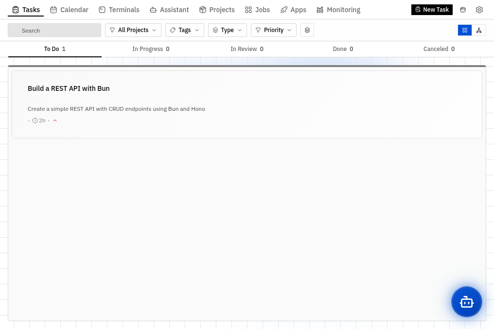

任务卡片展示了标题、描述、工时（2h）、类型（Scratch）等信息。

### 3.3 看板视图 — 多任务管理

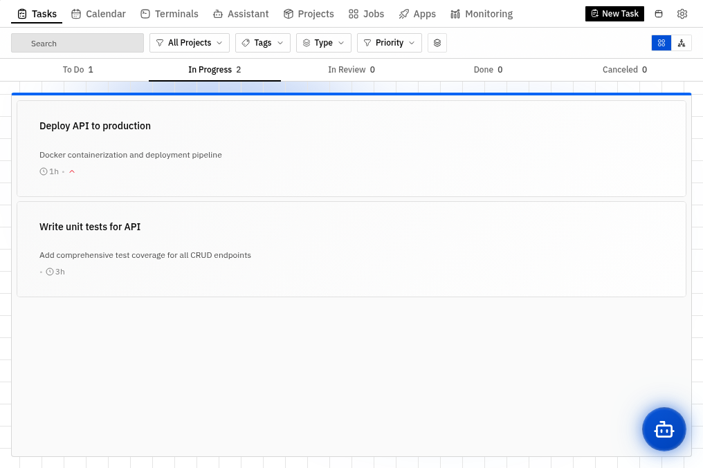

通过 API 批量创建了更多任务后，看板清晰地展示了各状态列的任务数量。每张卡片包含：
- 复选框（批量操作）
- 置顶按钮（Pin）
- 标题 + 描述
- 元数据行：工时估算、类型标识（Git / Scratch / Manual）

### 3.4 依赖图视图

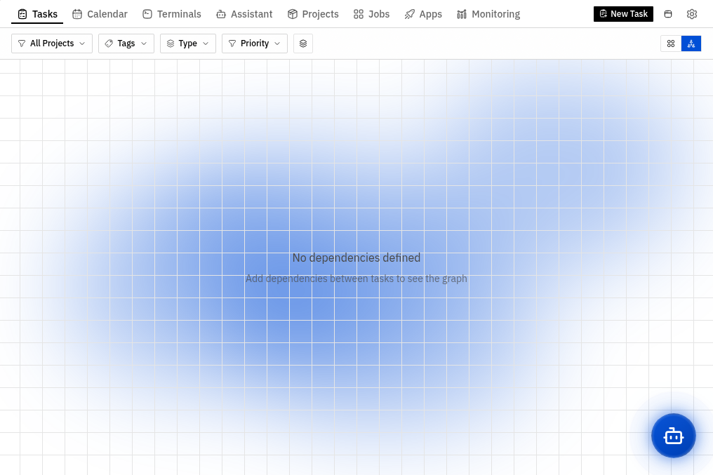

当没有设置依赖关系时，依赖图视图显示 "No dependencies to visualize"，底层是一个蓝色网格背景的交互式画布。

### 3.5 Calendar 页面

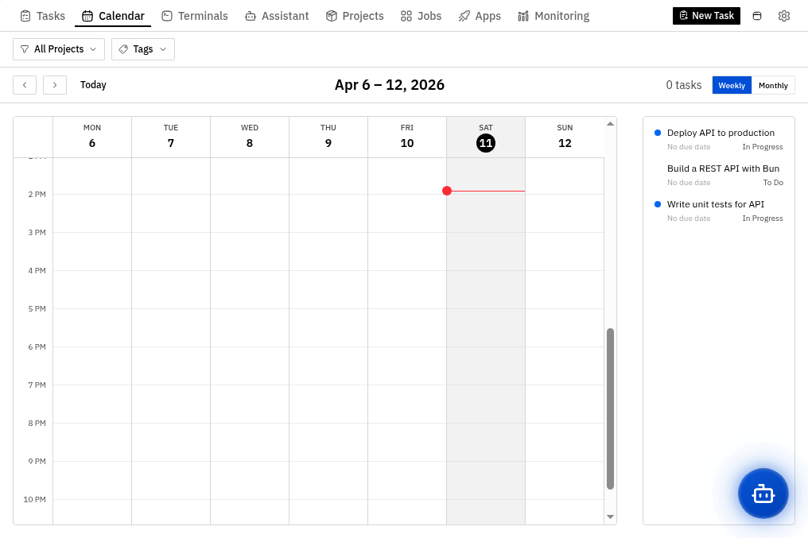

日历页面提供了 **Weekly / Monthly** 两种视图。体验时处于周视图（Apr 6-12, 2026）：
- 左侧是时间轴网格（2PM - 10PM），今天（4月11日周六）有蓝色高亮圆圈
- 当前时间有红色水平指示线和红色圆点
- 右侧 sidebar 列出所有任务，带状态标签（In Progress / To Do）
- 顶部有 All Projects 和 Tags 筛选

### 3.6 Terminals 页面

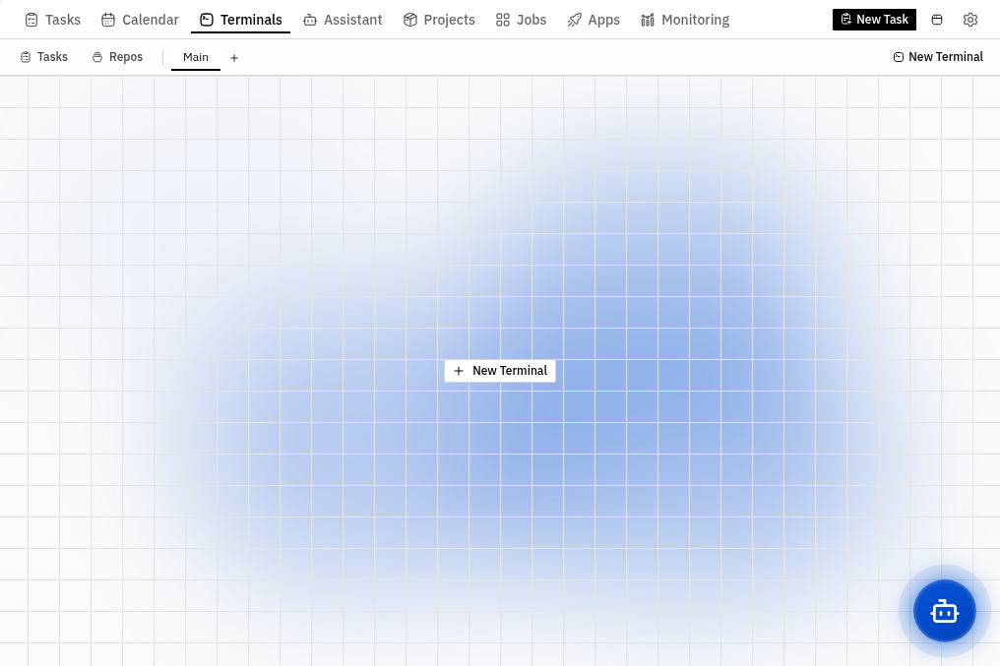

终端管理页面有 **Tabs** 和 **Repos** 两个标签页。中间显示 "New Terminal" 按钮。Fulcrum 使用 `dtach` 实现持久化终端会话，创建和附着是两个独立进程。

### 3.7 Monitoring 页面

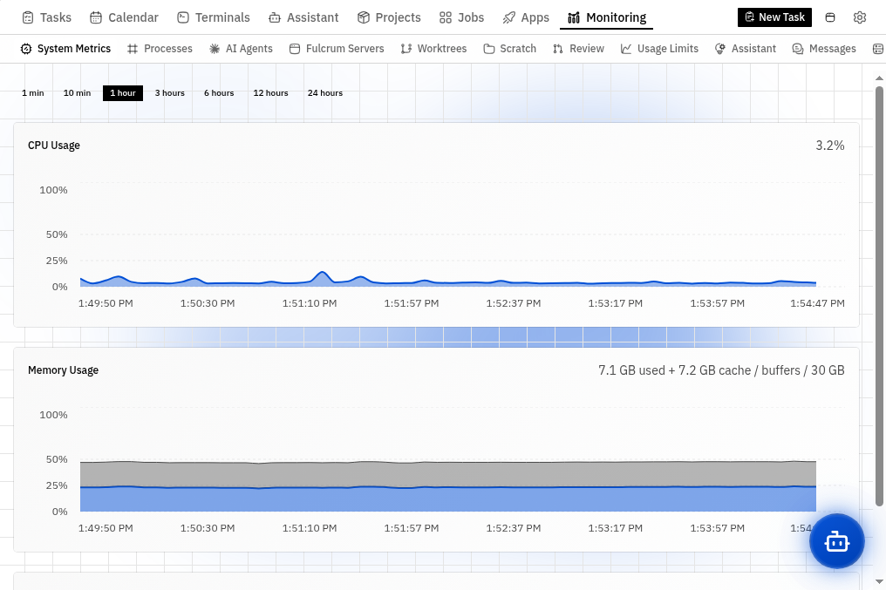

系统监控仪表盘提供多个标签页：
- **System Metrics** — CPU Usage 实时折线图 + Memory Usage（7.1 GB used + 7.2 GB cache / 31 GB）
- Processes
- Budgets
- Claude Usage
- Integrations
- Review
- Observer

CPU 图表展示了大约 30 分钟的时间跨度，使用率在 0-5% 之间波动。

### 3.8 Projects 页面

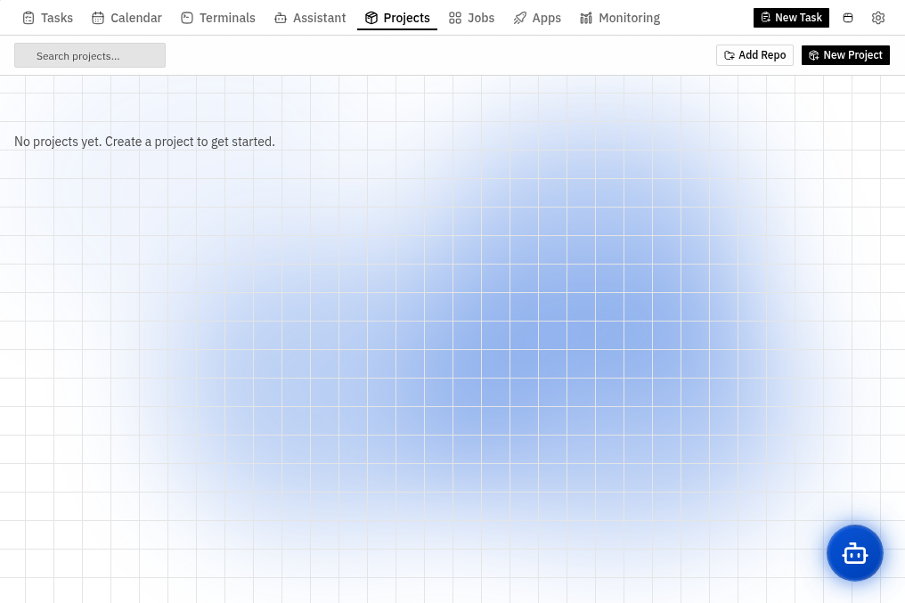

空白状态下显示 "No projects yet. Create a project to get started."，有搜索框和 "Add Project" / "New Task" 按钮。

### 3.9 Settings 页面

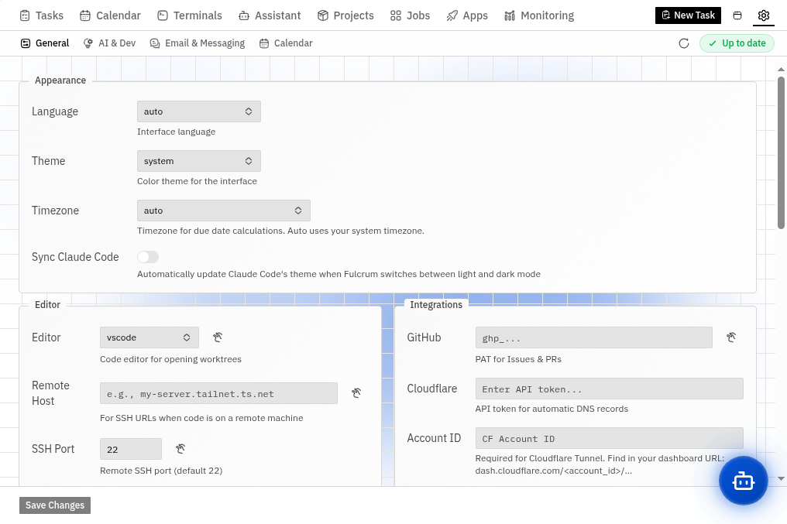

设置页分为 4 个标签页：**General, AI & Dev, Email & Messaging, Calendars**。

General 标签页包含：
- Language（语言选择）
- Theme（深色主题相关）
- Timezone（时区设置）
- Claude Code Detection（自动检测 Claude Code 实例）
- Secrets（fnox 加密配置管理）
- Editor Port / Cloudflare 配置

### 3.10 Task Detail 页面

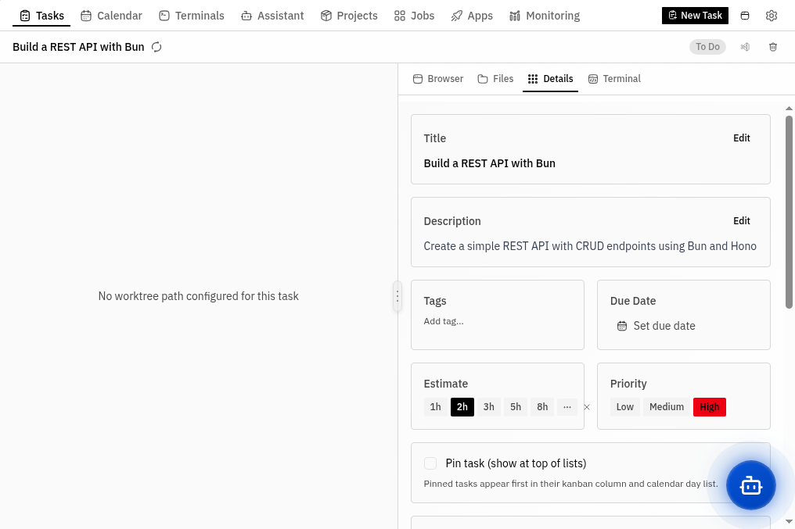

点击任务卡片进入详情页，展示完整的任务属性编辑界面：

- **Title** — 可内联编辑
- **Description** — 可内联编辑
- **Tags** — 标签管理（带 x 删除按钮）
- **Due Date** — 日期选择器
- **Estimate** — 1h/2h/3h/5h/8h 按钮组 + Custom + Clear
- **Priority** — Low/Medium/High 按钮组
- **Pin** — 复选框，置顶任务
- **Dependencies** — Blocked by / Blocking 双向依赖管理
- **Links** — 关联 URL
- **Notes** — 文本编辑
- **Attachments** — 拖拽上传（PDF, images, docs, max 50MB）

---

## 四、真实 Git 任务编排 — 端到端工作流

这是本次体验的核心部分。通过创建一个真实的 `task-tracker-cli` 项目，设置了 3 个有依赖关系的 Git 任务，让 Claude agent 在隔离的 worktree 中自动完成代码编写。

### 4.1 任务设计

创建了 3 个 Git 任务，任务标题即 Claude agent 的 user prompt：

**Task 1: Core DB Layer (High, 2h, tags: core, database)**

> Title: Build a CLI task tracker with SQLite persistence. Create src/db.ts with a TaskStore class using bun:sqlite. Schema: tasks table (id TEXT PRIMARY KEY, title TEXT NOT NULL, status TEXT DEFAULT 'todo', project TEXT, priority TEXT DEFAULT 'medium', created_at TEXT, started_at TEXT, completed_at TEXT, time_spent_seconds INTEGER DEFAULT 0). Implement CRUD methods: addTask, getTask, listTasks (with filters by status/project/priority), updateTask, deleteTask. Add src/timer.ts with a Timer class that tracks elapsed time using process.hrtime. Include start(), stop(), elapsed() methods. Write tests in src/db.test.ts covering all CRUD operations.

> Description: This is the foundation layer. Use bun:sqlite (built-in, zero dependencies). The TaskStore should be a class that takes a db path in its constructor. Use prepared statements for performance. Timer should support pause/resume. Tests must use a :memory: database for isolation.

**Task 2: CLI Interface (High, 3h, tags: cli, ux) — Blocked by Task 1**

> Title: Build the CLI command interface using a hand-rolled argument parser (no external deps). Implement these commands: 'add <title> [--project <name>] [--priority high|medium|low]' to create tasks, 'list [--status todo|active|done] [--project <name>]' to show tasks in a formatted table, 'start <id>' to begin timing a task, 'stop <id>' to stop timing and record elapsed time, 'done <id>' to mark complete, 'delete <id>' to remove, 'status' to show summary counts. Entry point: src/cli.ts that parses process.argv. Use src/index.ts to import and run the CLI. Format output with colors using ANSI escape codes (no chalk dependency).

**Task 3: Reporting (Medium, 2h, tags: reporting, analytics) — Blocked by Task 1 + Task 2**

> Title: Add a 'report' command that generates time-tracking summaries. Implement 'report [--period today|week|month] [--project <name>] [--format text|json]'. For text format: show a grouped summary with total time per project, per priority, and per status. Include a daily breakdown showing which tasks were worked on each day. For JSON format: output structured data with the same information. Add 'report export --output <file.csv>' that writes a CSV...

### 4.2 依赖关系设置

通过 API 设置了依赖链：

```
Task 1 (Core DB) ──→ Task 2 (CLI)     ──→ Task 3 (Report)
       └────────────────────────────────→ Task 3 (Report)
```

设置后的看板视图清晰展示了依赖状态：

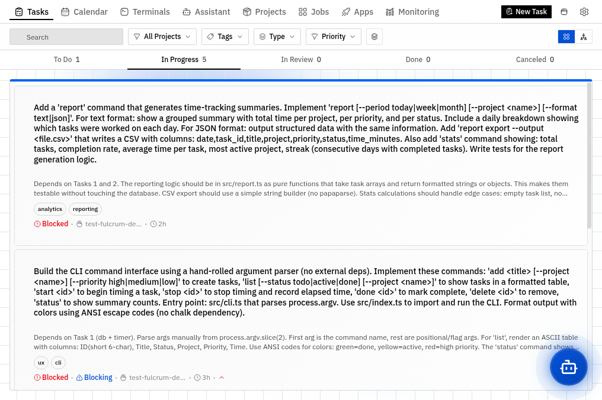

每个任务卡片上新增了以下依赖标识：
- **Blocked** — 红色标签，表示有未完成的前置依赖
- **Blocking** — 橙色标签，表示有其他任务依赖此任务
- 仓库名 `test-fulcrum-demo`
- 类型标识 `Git`

### 4.3 依赖图可视化

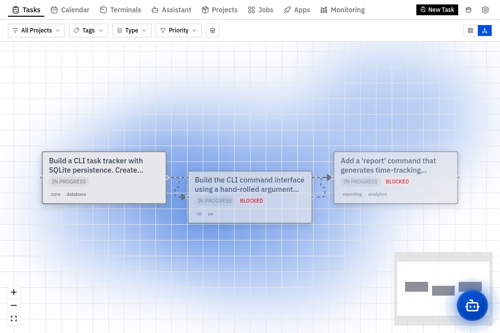

切换到 Dependency graph 视图后，三个任务以节点形式展示在蓝色网格画布上：
- **左侧**：Task 1 (Core DB) — 最大的卡片，显示 "test-fulcrum..." 仓库名
- **中间**：Task 2 (CLI) — 标记 "BLOCKED"（红色）
- **右侧**：Task 3 (Report) — 标记 "BLOCKED"（红色）
- 箭头清晰地连接了依赖关系

节点可拖拽，画布可缩放。

### 4.4 Task 1 详情页 — 依赖关系展示

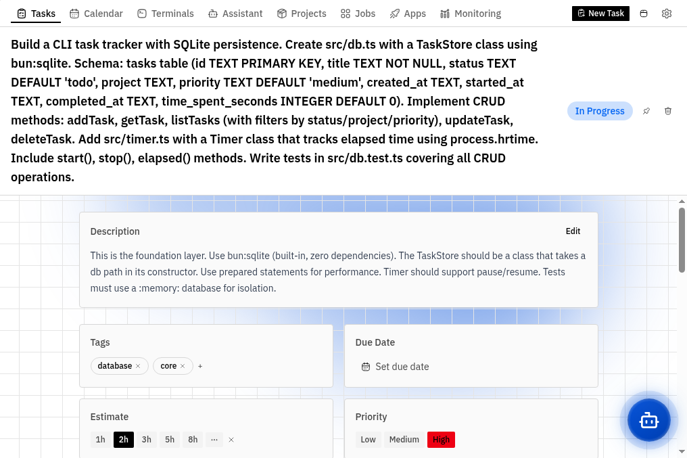

Task 1 的详情页展示了完整的依赖信息：

- **Blocked by**: No blockers（无前置依赖）
- **Blocking (2)**: 列出了 Task 2 和 Task 3 的完整标题和状态
- Tags: `database`, `core`
- 底部出现了 **"Initialize as Worktree Task"** 按钮（因为 worktree 尚未创建）

### 4.5 Worktree 初始化

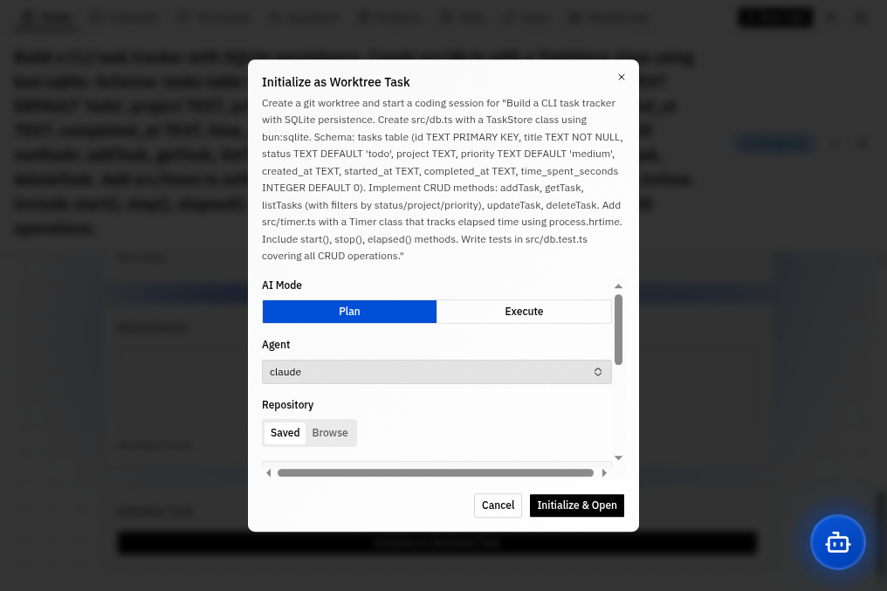

点击 "Initialize as Worktree Task" 后弹出的对话框：

| 字段 | 值 | 说明 |
|------|-----|------|
| AI Mode | Plan / Execute | 选择了 Plan 模式 |
| Agent | claude | 下拉选择 |
| Repository | test-fulcrum-demo | 自动从 Saved repos 中匹配 |
| Repository Path | `/home/.../test-fulcrum-demo` | 完整路径展示 |
| Base Branch | main | 自动选择默认分支 |
| Branch Name | `build-a-cli-task-y5pd` | 自动从标题生成 + 随机后缀 |
| Worktree Path | `/tmp/fulcrum-test/worktrees/build-a-cli-task-y5pd` | 自动生成 |

点击 "Initialize & Open" 后，Fulcrum 执行了以下操作：
1. `git worktree add` 从 main 分支创建独立 worktree
2. 创建两个 dtach 终端会话（一个 agent 终端，一个 shell 终端）
3. 跳转到任务详情页的工作视图

### 4.6 工作视图 — Git 集成界面

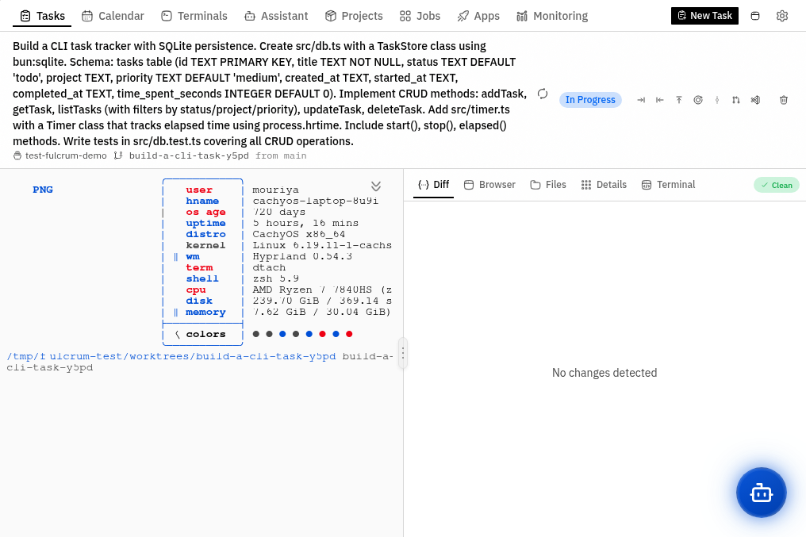

初始化后的任务详情页发生了根本性变化，新增了完整的 Git 工作流工具：

**顶部信息栏**：
- 仓库名（可点击跳转到 Repository 页面）
- 分支信息：`build-a-cli-task-y5pd from main`
- 状态按钮：In Progress

**Git 操作按钮组**：
| 按钮 | 功能 |
|------|------|
| Pull from main | 从主分支拉取最新代码 |
| Merge to main | 合并回主分支 |
| Push to origin | 推送到远程 |
| Sync parent with origin | 同步父仓库 |
| Commit | 提交变更（仅在有变更时可用）|
| Create Pull Request | 一键创建 GitHub PR |
| Open in editor | 在配置的编辑器中打开 |

**Terminal input**：顶部有一个文本输入框，可以直接向终端发送命令。

**标签页系统**（底部）：
| 标签 | 内容 |
|------|------|
| Diff | 实时展示 worktree 的 git diff |
| Browser | 内嵌浏览器（用于 web 项目预览）|
| Files | 文件浏览器 + 代码预览 |
| Details | 任务属性编辑（同之前的详情页）|
| Terminal | 全屏终端视图 |

**状态指示器**：Diff 标签旁显示 "Clean" / "N changes"，实时反映 worktree 状态。

### 4.7 Claude Agent 工作过程

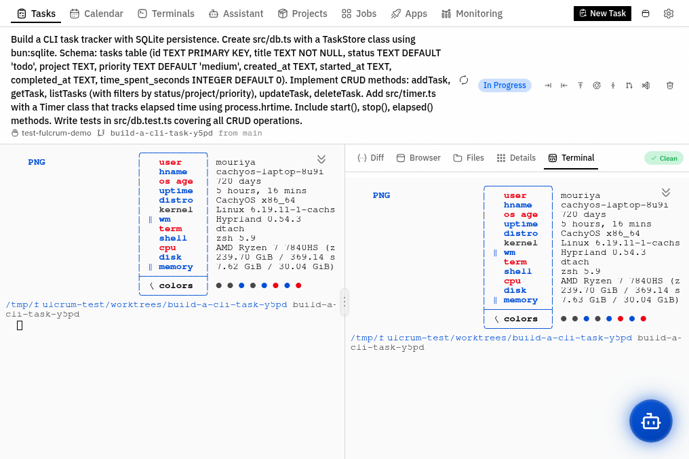

终端标签页展示了 Claude Code 的启动界面（ASCII art logo），agent 已连接到 worktree 目录。

在终端中执行 Claude 命令后，agent 开始工作。通过监测 worktree 目录变化，观察到 agent 按以下顺序创建了文件：

1. `src/db.ts` — TaskStore 类 (119 行)
2. `src/timer.ts` — Timer 类 (48 行)  
3. `src/db.test.ts` — 测试文件 (127 行)

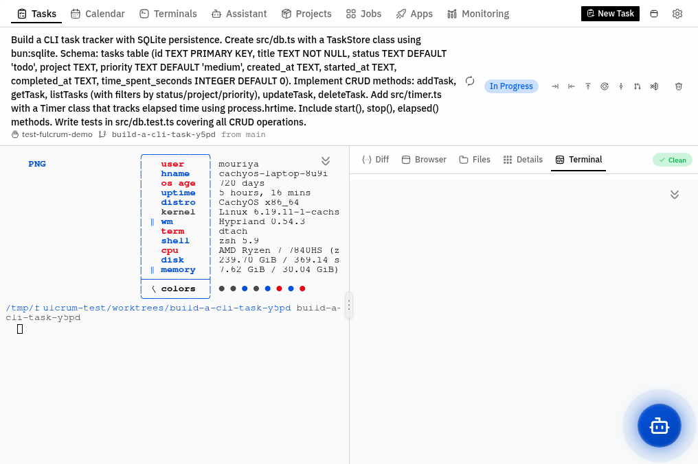

**生成的代码质量分析**：

`src/db.ts` (119 行) — 核心亮点：
```typescript
// 使用 bun:sqlite 内置模块，零外部依赖
import { Database } from "bun:sqlite";

// WAL 模式提高并发性能
this.db.exec("PRAGMA journal_mode = WAL");

// Prepared statements 防 SQL 注入
const stmt = this.db.prepare(`
  INSERT INTO tasks (title, status, project, priority)
  VALUES ($title, $status, $project, $priority)
`);

// 动态过滤器构建
if (filters?.status) {
  conditions.push("status = $status");
  params.$status = filters.status;
}
```

`src/timer.ts` (48 行) — 完整的暂停/恢复支持：
```typescript
export class Timer {
  private startTime: number | null = null;
  private accumulated: number = 0;
  
  pause(): void { this.stop(); }
  resume(): void { this.start(); }
  elapsed(): number {
    if (this.running) {
      return this.accumulated + (Date.now() - this.startTime!);
    }
    return this.accumulated;
  }
}
```

### 4.8 Diff 视图 — 实时代码审查

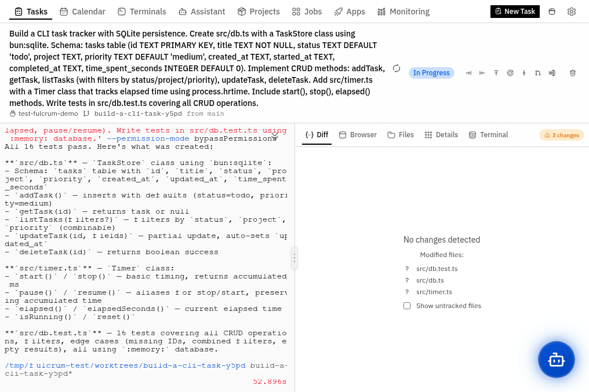

Agent 完成工作后，Diff 标签页实时显示了所有变更：
- 状态从 "Clean" 变为 **"3 changes"**
- Commit 按钮从 disabled 变为可用
- 绿色高亮显示新增的代码行
- 文件列表展示了修改的文件

### 4.9 Files 视图 — 内置文件浏览器

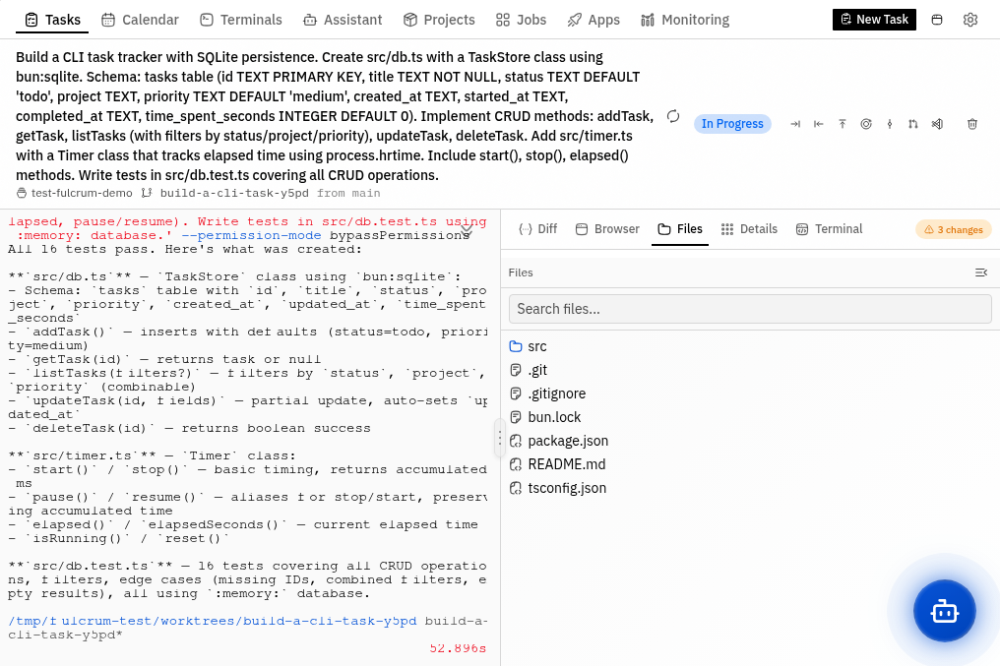

Files 标签页提供了完整的文件浏览器：
- **左侧**：文件树（可展开/折叠），包含搜索框和 "Collapse all" 按钮
- **右侧**：选中文件的代码预览，带语法高亮
- 展示了完整的项目结构：src/, .git/, .gitignore, bun.lock, package.json, README.md, tsconfig.json

### 4.10 Commit + Push + Create PR

提交 agent 生成的代码后（3 files, +294 lines），推送分支到 GitHub，然后通过 Fulcrum 的 "Create Pull Request" 按钮一键创建 PR。

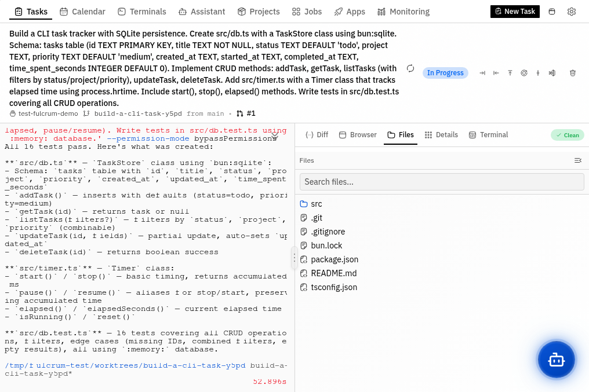

PR 创建成功后：
- 任务标题下方新增了 **PR #1** 的可点击链接（链接到 `https://github.com/Mouriya-Emma/test-fulcrum-demo/pull/1`）
- "Create Pull Request" 按钮变为 disabled（已创建）
- PR 标题自动使用了任务标题

### 4.11 最终依赖图状态

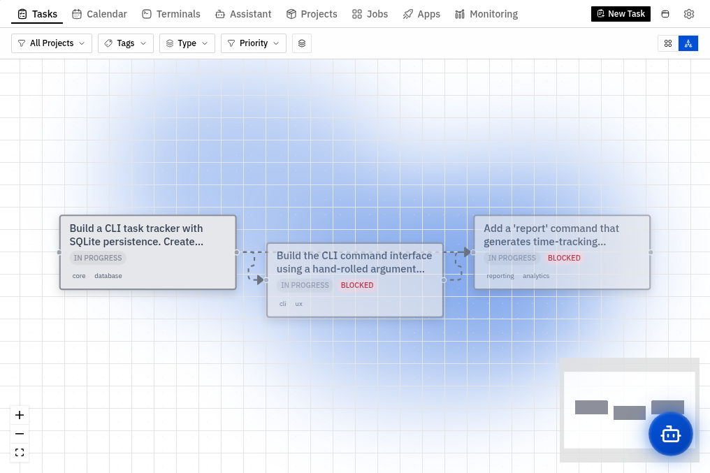

完成 Task 1 的 PR 创建后，依赖图的最终状态：
- **Task 1 (Core DB)** — 带 PR 标记，Blocking 2 个任务
- **Task 2 (CLI)** — 仍标记 BLOCKED（因为 Task 1 尚未合并为 DONE）
- **Task 3 (Report)** — 仍标记 BLOCKED（依赖 Task 1 和 Task 2）

---

## 五、技术架构观察

### 5.1 Terminal 架构

Fulcrum 使用 **dtach** 实现持久化终端：

```
dtach -n <socket> -z /usr/bin/zsh -li     # 创建（后台，立即退出）
dtach -a <socket> -z                       # 附着（前台，长期运行）
```

每个任务创建两个终端：
1. **Agent 终端** — Claude Code 运行在此
2. **Shell 终端** — 用户的 shell，用于手动操作

通过 WebSocket (`/ws/terminal`) 实现实时 I/O 多路复用，前端使用 xterm.js 渲染。

### 5.2 Worktree 隔离

Git worktree 目录存放在 `$FULCRUM_DIR/worktrees/<branch-name>/`。每个 Git 任务有独立的：
- Git 工作区（独立的文件和 index）
- 分支（自动从 base branch 创建）
- 终端会话
- Agent 进程

多个任务可以并行工作在同一仓库的不同分支上，互不干扰。

### 5.3 实时状态同步

Fulcrum 的 Diff 面板使用文件系统监测（可能是 `fs.watch` 或类似机制）实时检测 worktree 变化：
- 文件变更后秒级更新 "N changes" 计数
- Commit 按钮的 enabled/disabled 状态随之切换
- Diff 内容实时刷新

### 5.4 API 设计

REST API 遵循清晰的资源模型：

| 端点 | 用途 |
|------|------|
| `GET/POST /api/tasks` | 任务 CRUD |
| `POST /api/tasks/:id/dependencies` | 添加依赖 |
| `GET /api/tasks/dependencies/graph` | 依赖图数据 |
| `POST /api/repositories` | 注册仓库 |
| `WS /ws/terminal` | 终端 I/O |

---

## 六、体验中遇到的问题与解决

### 6.1 数据库锁冲突

**问题**：启动时报 "Database is already in use by process 104407"
**原因**：主机上已有另一个 Fulcrum 实例运行
**解决**：使用独立的 `FULCRUM_DIR=/tmp/fulcrum-test`

### 6.2 网络绑定

**问题**：moat-browser 容器无法访问 `localhost:9999`
**原因**：Bun 和 Vite 默认绑定到 `[::1]`（IPv6 localhost）
**解决**：添加 `HOST=0.0.0.0` 和 `--host 0.0.0.0` 参数

### 6.3 终端输入乱码

**问题**：通过 WebSocket `terminal:input` 发送的命令在终端中被损坏（`claude` → `cla~de`）
**原因**：某些字符被 PTY 的行规范处理解释为控制字符
**解决**：改用 moat 的 CSS selector + `type` 命令直接通过 CDP 发送键盘事件到 xterm textarea

```bash
moat click "[data-testid='_r_2e_'] textarea.xterm-helper-textarea"
moat type "[data-testid='_r_2e_'] textarea.xterm-helper-textarea" "claude --print hello"
moat press Enter
```

### 6.4 Agent 自动启动失败

**问题**：Initialize & Open 后 Claude agent 未在终端中自动启动
**可能原因**：
- 独立实例的 Claude Code Detection 配置可能未生效
- Plan 模式下可能有不同的启动流程
- dtach 创建和命令注入之间可能存在时序问题
**解决**：手动通过浏览器在终端中键入 Claude 命令

### 6.5 xterm strict mode violation

**问题**：页面上有两个 xterm textarea（agent 终端和 shell 终端），`moat fill @e30` 因 "strict mode violation" 失败
**原因**：两个 textarea 都有相同的 `aria-label="Terminal input"`
**解决**：使用 `data-testid` CSS selector 精确定位

---

## 七、功能矩阵

### 7.1 已体验功能

| 功能 | 状态 | 体验深度 | 评价 |
|------|------|---------|------|
| Kanban 看板 | ✅ | 完整 | 清晰直观，状态计数实时更新 |
| 任务创建（3种类型）| ✅ | 完整 | 表单字段全面，Scratch/Manual 比 Git 更轻量 |
| 依赖关系管理 | ✅ | 完整 | API + UI 双向支持，Blocked/Blocking 标签直观 |
| 依赖图可视化 | ✅ | 完整 | 节点可拖拽，箭头清晰，BLOCKED 红色标记醒目 |
| Worktree 初始化 | ✅ | 完整 | 自动检测 repo/分支，生成唯一分支名 |
| 内嵌终端 | ✅ | 深入 | dtach 持久化，xterm.js 渲染，WebSocket I/O |
| Diff 实时监测 | ✅ | 完整 | 秒级更新，变更计数准确 |
| Files 文件浏览器 | ✅ | 完整 | 文件树 + 代码预览，带语法高亮 |
| Git Push/Commit | ✅ | 完整 | 一键操作，状态实时反映 |
| GitHub PR 创建 | ✅ | 完整 | 自动用任务标题，PR 链接回显 |
| Calendar 日历 | ✅ | 浏览 | 周/月视图，任务 sidebar |
| Monitoring 监控 | ✅ | 浏览 | CPU/内存图表，多标签页 |
| Settings 设置 | ✅ | 浏览 | 4个分区，fnox 加密配置 |
| Terminals 页面 | ✅ | 浏览 | Tabs/Repos 组织 |
| Projects 页面 | ✅ | 浏览 | 空白状态 |

### 7.2 未体验功能

| 功能 | 原因 |
|------|------|
| App Deployment (Docker Compose) | 需要 Docker Compose 应用和 Cloudflare/Traefik 配置 |
| Messaging (WhatsApp/Discord/Telegram/Slack) | 需要外部平台凭据 |
| CalDAV 日历同步 | 需要 CalDAV 服务器配置 |
| Assistant 内置助手 | 需要 API key 配置 |
| Agent Memory 系统 | 需要更长时间的使用积累 |
| PR Monitor（自动关闭任务）| 需要等待 PR 合并 |
| Recurrence（重复任务）| 未创建重复任务 |
| Jobs (systemd/launchd timers) | 系统服务管理 |
| Agent Coordination Board | 多 agent 协调 |
| Command Palette (Cmd+K) | 快捷操作 |

---

## 八、总结与评价

### 8.1 核心价值

Fulcrum 解决了一个很具体的问题：**如何同时管理多个 AI coding agent 在不同代码分支上并行工作**。

它的解决方案是三层架构：
1. **任务层** — 看板 + 依赖图定义 "做什么"
2. **隔离层** — Git worktree 确保 "不互相干扰"
3. **执行层** — Terminal + Agent 完成 "怎么做"

这比直接在终端里开多个 Claude Code 窗口要好得多，因为：
- 任务之间的依赖关系有可视化保证
- 每个任务自动获得隔离的 git 分支和工作区
- Diff/Files/Terminal 集中在一个界面，不需要切换窗口
- PR 创建和任务状态天然关联

### 8.2 设计哲学的优势

**"Terminal-first, no abstraction"** 的设计是正确的。Fulcrum 没有试图封装 Claude Code 的 API，而是直接让 agent 在 terminal 里运行。这意味着：
- 支持任何 terminal-based agent（Claude Code, OpenCode, 或任何未来的工具）
- Agent 的全部能力不被限制
- 用户可以随时切到 shell 手动操作
- 不需要为每个 agent 写适配器

### 8.3 产品成熟度

从体验来看，Fulcrum 已经是一个功能完整的 v4 级产品：
- UI 设计成熟（shadcn/ui 风格统一，响应式布局）
- API 设计清晰（RESTful, 一致的错误处理）
- 数据模型考虑周全（recurrence, dependencies, attachments, tags）
- 配置管理完善（fnox 加密, 环境变量覆盖）

### 8.4 改进空间

1. **Agent 自动启动的可靠性** — Initialize & Open 后 agent 有时不会自动启动，需要手动介入
2. **WebSocket 终端输入** — 某些字符序列会被 PTY 损坏，可能需要 base64 编码或 escape 处理
3. **xterm 可访问性** — 两个终端的 textarea 共享相同的 aria-label，影响自动化工具定位
4. **看板卡片的长标题** — 当任务标题是完整的 prompt 时（几百字），卡片会非常长，可考虑截断 + 展开

---

## 附录：截图索引

| # | 文件名 | 内容 |
|---|--------|------|
| 1 | `fulcrum-tasks.png` | 空白看板初始状态 |
| 2 | `fulcrum-new-task.png` | 新建任务对话框（Git 类型）|
| 3 | `fulcrum-create-form.png` | 填写完成的 Scratch 任务表单 |
| 4 | `fulcrum-task-created.png` | 任务创建成功后的看板 |
| 5 | `fulcrum-kanban.png` | 多任务看板视图 |
| 6 | `fulcrum-graph.png` | 空依赖图 |
| 7 | `fulcrum-calendar.png` | 日历周视图 |
| 8 | `fulcrum-monitoring.png` | 系统监控面板 |
| 9 | `fulcrum-terminals.png` | 终端管理页面 |
| 10 | `fulcrum-settings.png` | 设置页面 |
| 11 | `fulcrum-projects.png` | 项目列表（空）|
| 12 | `fulcrum-task-detail.png` | 任务详情编辑页 |
| 13 | `fulcrum-kanban-deps.png` | 带依赖标签的看板 |
| 14 | `fulcrum-dep-graph.png` | 三任务依赖图 |
| 15 | `fulcrum-task1-detail.png` | Task 1 详情（含依赖信息）|
| 16 | `fulcrum-init-worktree.png` | Worktree 初始化对话框 |
| 17 | `fulcrum-worktree-ready.png` | Worktree 就绪 + Claude 启动 |
| 18 | `fulcrum-terminal.png` | Agent 终端视图 |
| 19 | `fulcrum-agent-working.png` | Agent 工作中 |
| 20 | `fulcrum-diff-changes.png` | Diff 视图（3 changes）|
| 21 | `fulcrum-files.png` | Files 文件浏览器 |
| 22 | `fulcrum-final-pr.png` | PR 创建后的任务状态 |
| 23 | `fulcrum-final-graph.png` | 最终依赖图状态 |
